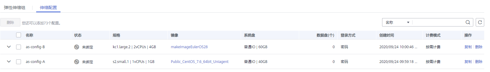

# 更换伸缩组的伸缩配置

## 操作场景

当伸缩组中所需的弹性云服务器规格变更，需要为伸缩组更换伸缩配置时，可以参考此章节进行更换伸缩配置。

## 更换伸缩配置后的生效时间

若伸缩组正在进行伸缩活动，则当前伸缩活动中的实例配置以更换之前的伸缩配置为准；待下一次伸缩活动开始后，伸缩活动中的实例配置就会更改为更换后的伸缩配置。

例如：伸缩组当前的伸缩配置为as-config-A，更换后的伸缩配置为as-config-B，当伸缩组正在进行伸缩活动时，则当前伸缩活动中的实例配置仍然为as-config-A；

待下一次伸缩活动开始后，伸缩活动中的实例配置就会更改为as-config-B。

**图 1**  更换伸缩配置举例  

## 操作步骤

1.  登录管理控制台。
2.  选择“计算 \> 弹性伸缩 \> 伸缩实例 \> 弹性伸缩组”。
3.  单击需要更换伸缩配置的伸缩组名称，在“概览”页面的“配置名称”右方，单击“更换配置”。

    或在需要更换伸缩配置的伸缩组所在行的“操作”列下，选择“更多 \> 更换伸缩配置”。

4.  在弹出的“更换伸缩配置”对话框中，重新为伸缩组选择伸缩配置。
5.  单击“确定”。

